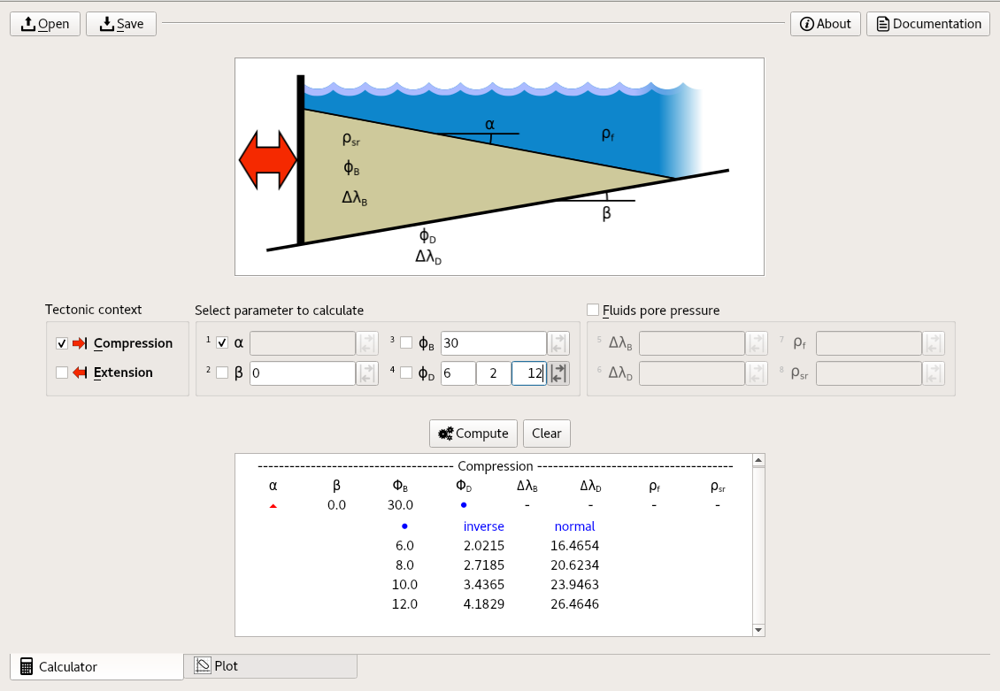
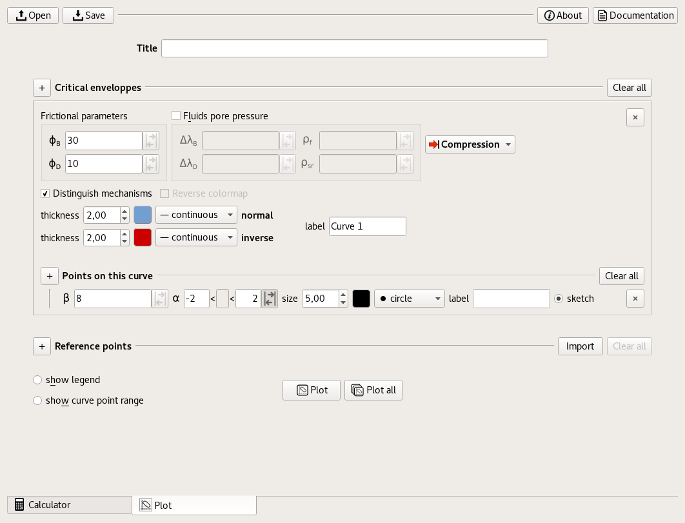
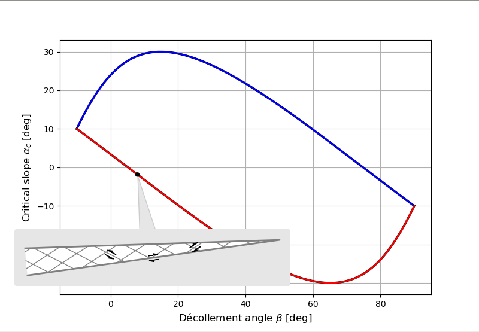
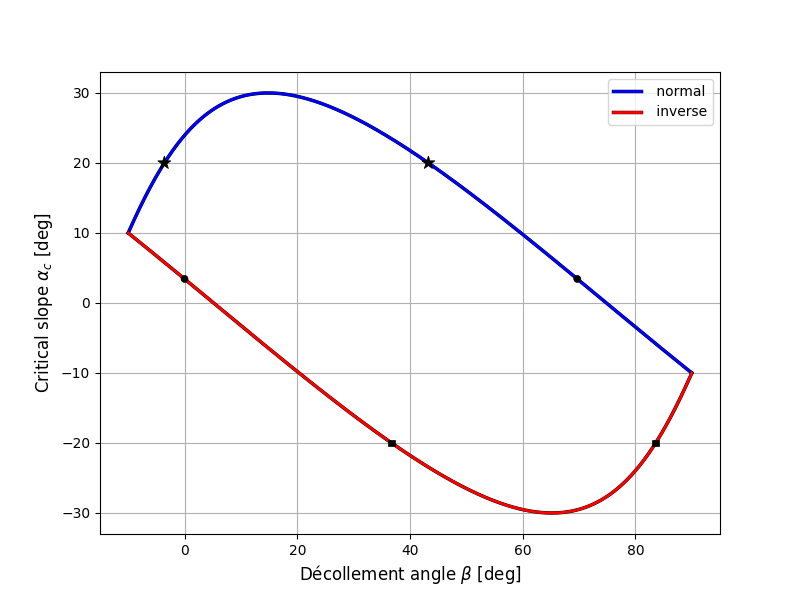

|ECCW-GUI|
##########

Exact Critical Coulomb Wedge - Graphical User Interface
=======================================================

**ECCW** and **ECCW-GUI** allow to compute the exact solution of any parameter of critical Coulomb wedge (as Dahlen 1984 and Yuan et al. 2015). They allow to draw any of these solutions in the β vs α domain (basal slope against surface slope). Are availables compressive or extensive geological context and fluid pore pressure.

**ECCW** and **ECCW-GUI** are under GNU GPL-v3 license.

*******************************************************************

Overview
========

General informations
++++++++++++++++++++

* *ECCW* is a *python3* library;
* *ECCW-GUI* is a graphical user interface, written in *python3* and using *Qt*;
* In the GUI, you can save a session and keep it in an xml file (.eccw);
* A pdf documentation is available (see Usage section) including:
    * usage explainations;
    * theoretical explainations 
    * guidelines of the results interpretation;
    * blueprints of the equations implemantation.

Calculator App
++++++++++++++

* Compute the solution of the *Critical Coulomb Wedge* for compressive or extensive tectonic context, with or without fluids overpressure.
* The solution can be computed with one of the four main parameters set as unknown.
* A range of solutions can be computed at once if you set one of the known parameters as a range.

|Screen copy of calculator-app|

Plot App
++++++++

* Plot the solution of the *Critical Coulomb Wedge* in matplotlib windows (includes zooms, exports, and more).
* A range of solutions can be ploted at once if you set one of the known parameters as a range.
* You can explore graphically points on the solution curve, with optional display of a sketch representing orientations and directions of faults.
* Refrences points can be manually added or imported from .csv files.

|Screen copy of plot-app|

|Screen copy of plot-app's plot window|

*******************************************************************

Installation
============

Windows
+++++++

.. note :: Only tested on *Windows 7*.

1. Install python3 verson of **miniconda** python environment from https://conda.io/miniconda.html
    a. run downloaded .exe;
    b. at **Advanced Options** step, tick checkbox named *Add Anaconda to my PATH environment variable*.

2. Launch the windows **Command Prompt**:
    a. type ``conda`` to check that *conda* is correctly installed;
    b. type ``pip`` to check that *pip* is also correctly installed.

3. Install *ECCW* with the following command in the *Command Prompt*::

    $ pip install eccw-gui

4. *ECCW* is then available from the *Command Prompt* by taping ``eccw`` or simply from the main *Windows* menu under the name *eccw*.

Linux
+++++

.. note :: Only tested on *Debian 9 (Gnome)* and *Ubuntu 16.04 (Unity)*.

Installation using pip
----------------------

1. Install **pip** and **tk** for *Python3*. 
   On *Debian* family distributions, you can install these packages using the following command::

      $ sudo apt-get install python3-pip python3-tk

2. Install *ECCW* with the following command::

      $ pip3 install eccw-gui

3. *ECCW* is then available from a terminal by taping ``eccw`` or simply from the main menu under the name *eccw*.

Installation from sources
-------------------------

1. Install the folowing dependancies for python3:

	| tk
	| pyqt5
	| numpy
	| matplotlib
	| xmltodict

   On *Debian* family distributions, you can install these packages using the following command::

      $ sudo apt-get install python3-tk python3-pyqt5 python3-numpy python3-matplotlib python3-xmltodict

2. Download and install eccw_.
   Using a terminal with current working directory setted on *ECCW* sources folder, you can install *ECCW* with the following command::

      $ python3 setup.py install

3. Download and install eccw-gui_.
   Using a terminal with current working directory setted on *ECCW-GUI* sources folder, you can install *ECCW-GUI* with the following command::

      $ python3 setup.py install

4. *ECCW* is then available from a Terminal by taping ``eccw``

.. note:: You can also launch *ECCW* without installation (but with dependancies installed) if you add the path to the *ECCW* and *ECCW-GUI* sources folders to the environment variable ``$PYTHONPATH``::

    $ export PYTHONPATH=${PYTHONPATH}:path/to/eccw/sources/
    $ export PYTHONPATH=${PYTHONPATH}:path/to/eccw_gui/sources/

    These commands can be added to your ``.bashrc`` file (hidden file located at the root of your home).
    Once the PYTHONPATH is seted, you can launch *ECCW-GUI* by running the ``main.py`` file in the sources folder of *ECCW-GUI*.

*******************************************************************

Usage
=====

GUI usage
+++++++++

Simply type ``eccw`` in a shell to launch *eccw*.
The GUI should also be available from the main menu.

To obtain help with text based mode, type::

    $ eccw -h

You can access off-line documentation with::

    $ eccw -d

The documentation is also available using the button 'Documentation' of the GUI.

Python library usage
++++++++++++++++++++

You can import and use the core objects for computing and plotting *Critical Coulomb Wedge* from python as discribed in what follows.

EccwCompute
-----------

This the core object that compute the solutions of the *CCW* problem.
::

    >>> from eccw import EccwCompute
    >>> foo = EccwCompute(phiB=30, phiD=10, beta=0)
    >>> foo.show_params()
    { context       : 'Compression'
      beta          : 0.0
      alpha         : nan
      phiB          : 30.0
      phiD          : 10.0
      rho_f         : 0.0
      rho_sr        : 0.0
      delta_lambdaB : 0.0
      delta_lambdaD : 0.0
    }
    >>> foo.compute("alpha")
    (3.4365319302835018, 23.946319406533199)

The result obtained with the ``compute`` method is always a tuple of two elements.
First result is for **inverse** fault mechanism context, second result is for **normal** fault mechanism context.

The ``beta`` parameter gets a specificity : 0, 1 or 2 results could be obtained in both the normal of inverse context.
This is the reason ``beta`` results are tuples of tuples.
::

    >>> foo.alpha = 3.436532
    >>> foo.compute("beta")
    ((-1.0516746372768912e-07,), (69.6779628783264,))
    >>> foo.alpha = 20
    >>> foo.compute("beta")
    ((), (-3.580929608343892, 43.25889259183777))
    >>> foo.alpha = -20
    >>> foo.compute("beta")
    ((36.74110740816224, 83.58092960834391), ())

Have a look on the plot obtained in next section to understand the previous results.

EccwPlot
--------

This the core object that plot the solutions of the *CCW* problem. This object inherits from ``EccwCompute``.
::

    >>> from eccw import EccwPlot
    >>> foo = EccwPlot(phiB=30, phiD=10)
    >>> foo.add_curve(inverse={'color':(1,0,0,1), 'label':'inverse'},
                      normal={'color':(0,0,1,1), 'label':'normal'})
    >>> foo.add_point(alpha=3.436532)
    >>> foo.add_point(alpha=20, style='*', size=10)
    >>> foo.add_point(alpha=-20, style='s')
    >>> foo.add_legend()
    >>> foo.show()

|Screen copy of EccwPlot's plot|

*******************************************************************

Contributing
============

Additional dependancies
+++++++++++++++++++++++

Some softwares are needed to convert Qt specific files into python code:

 * pyuic5 is used to convert form ``.ui`` files into python code calling PyQt;
 * pyrcc5 is used to convert Qt ressources files ``.qrc`` into python module.

Both are found in following dependancies (ubuntu / debian):

    | pyqt5-dev-tools

If you want to install Qt-designer for Qt5 on Ubuntu/debian, this app is included in the following package:

    | qttools5-dev-tools

Informations for developpers
++++++++++++++++++++++++++++

* Convert xml .ui files created using *Qt-Designer* into python files::

    $ pyuic5 -x xxx.ui -o xxx_Viewer.py

  Some bash scripts located in ``gui/*/viewers`` folders named ``make_viewers.sh`` automatise this process.
  Some custom corrections of *Qt* objects dimensions are also embedded in this script.

* Convert *Qt* ressources .qrc files created using *Qt-Designer* into python files::

    $ pyrcc5 xxx.qrc -o xxx_rc.py

  These ressources files are a smart way to embed images into source code and solve the access path to these images problem after desktop installation.

* All graphical object (Qt-derived) get the following methods:

    * getParams:   return an OrderedDict that describe the state of the object.
    * setParams:   set the object with a dict obtained from getParams.
    * getSelect:   return an OrderedDict that describe the selected parameters to treat (equal to getParams if the paramters gets single state).

.. _eccw: https://github.com/bclmary/eccw.git

.. _eccw-gui: https://github.com/bclmary/eccw_gui.git

