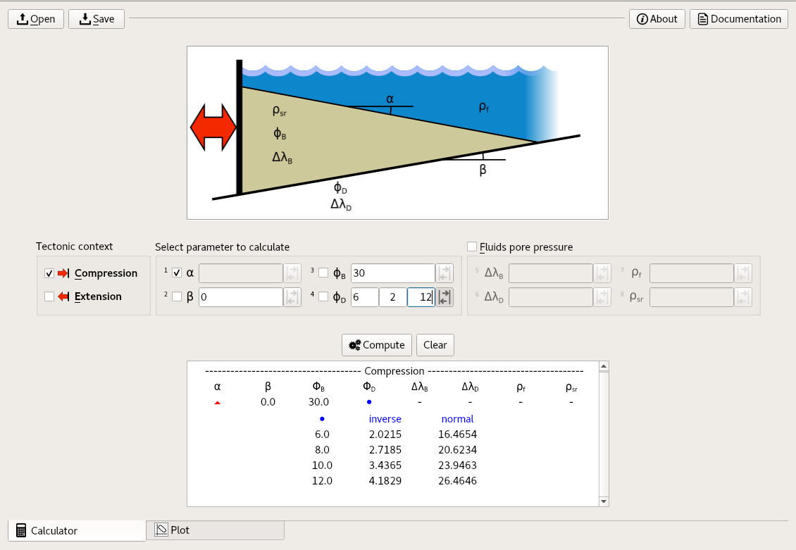
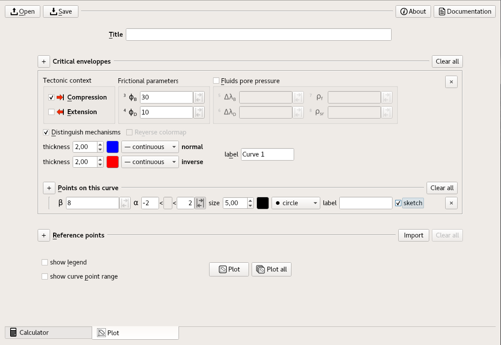
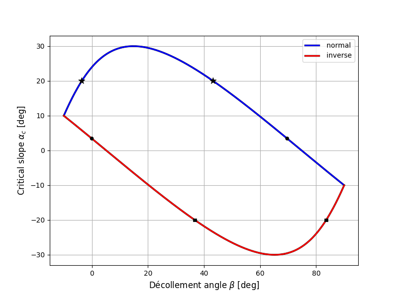

# Overview

## General informations

-   *ECCW* is a *python3* library;

-   *ECCW-GUI* is a graphical user interface, written in *python3* and
    using *Qt*;

-   In the GUI, you can save a session and keep it in an xml file
    (.eccw);

-   A pdf documentation is available (see Usage section) including:

    -   usage explainations;
    -   theoretical explainations
    -   guidelines of the results interpretation;
    -   blueprints of the equations implemantation.

## Calculator App

-   Compute the solution of the *Critical Coulomb Wedge* for compressive
    or extensive tectonic context, with or without fluids overpressure.
-   The solution can be computed with one of the four main parameters
    set as unknown.
-   A range of solutions can be computed at once if you set one of the
    known parameters as a range.

{width=90%}

## Plot App

-   Plot the solution of the *Critical Coulomb Wedge* in matplotlib windows (includes zooms, exports, and more).
-   A range of solutions can be ploted at once if you set one of the known parameters as a range.
-   You can explore graphically points on the solution curve, with optional display of a sketch representing orientations and directions of faults.
-   Refrences points can be manually added or imported from `.csv` files.

{width=90%}

{width=90%}

# Usage

## GUI usage

Simply type `eccw` in a shell to launch *eccw*. The GUI should also be
available from the main menu.

To obtain help with text based mode, type:

    $ eccw -h

You can access an off-line documentation using the button “Documentation” in the GUI. 
Alternatively, you can use the following command, without the GUI:

    $ eccw -d

You can launch the GUI with the `-m` option of python using the canonic syntax:

    python -m eccw_gui

## Python library usage

You can import and use the core objects for computing and plotting *Critical Coulomb Wedge* from a python session as discribed in what follows.

### EccwCompute

This the core object that compute the solutions of the *CCW* problem. :

    >>> from eccw import EccwCompute
    >>> foo = EccwCompute(phiB=30, phiD=10, beta=0)
    >>> foo.show_params()
    { context       : 'Compression'
      beta          : 0.0
      alpha         : nan
      phiB          : 30.0
      phiD          : 10.0
      rho_f         : 0.0
      rho_sr        : 0.0
      delta_lambdaB : 0.0
      delta_lambdaD : 0.0
    }
    >>> foo.compute("alpha")
    ((3.4365319302835018,), (23.946319406533199,))

The result obtained with the `compute` method is always a tuple of two tuples. 
The first tuple contains results in **inverse** fault mechanism, while the second tuple contains results in **normal** fault mechanism.
These tuples can each contain 0, 1 or 2 values, with a total always equal to 0 or 2. 
Here some more examples with computation of beta `parameter`:: :

    >>> foo.alpha = 3.436532
    >>> foo.compute("beta") 
    ((-1.0516746372768912e-07,), (69.6779628783264,))
    >>> foo.alpha = 20
    >>> foo.compute("beta") 
    ((), (-3.580929608343892, 43.25889259183777))
    >>> foo.alpha = -20
    >>> foo.compute("beta") 
    ((36.74110740816224, 83.58092960834391), ())
    >>> foo.alpha = -35
    >>> foo.compute("beta") 
    ((), ())

Have a look on the plot obtained in next section to understand these results.

### EccwPlot

This the core object that plot the solutions of the *CCW* problem. This
object inherits from `EccwCompute`. :

    >>> from eccw import EccwPlot
    >>> foo = EccwPlot(phiB=30, phiD=10)
    >>> foo.add_curve(inverse={'color':(1,0,0,1), 'label':'inverse'}, 
                      normal={'color':(0,0,1,1), 'label':'normal'})
    >>> foo.add_point(alpha=3.436532)
    >>> foo.add_point(alpha=20, style='*', size=10)
    >>> foo.add_point(alpha=-20, style='s')
    >>> foo.add_legend()
    >>> foo.show()

{width=90%}

# Understand ECCW {#sec:understand_ECCW}

## The critical coulomb wedge theory.

{#fig:dahlen-geometry}

{#fig:subcritical width=90%}

{#fig:supercritical width=90%}

## Criticality.

The critical enveloppe defines three domains of stability (see @fig:domains):

-   Super-critical

-   Sub-critical

-   Critical

In the super-critial doamin, outside the enveloppes, no internal deformation occurs. 
The prism only slides on the basal décollement (@fig:supercritical). 
In the sub-critical domain, including the enveloppes, some internal deformations occurs. 
This deformation will appears along the pushing back-wall in the sub-critical domain (@fig:subcritical), while it can occurs *anywhere* inside the prism at the exact critical state.

{#fig:domains}

## Motor of faulting

{#fig:example_section-comp}

{#fig:example_section-ext}

Mathematically constituted of four parts due to the two $\arcsin$ included in the impicite solution (see @sec:compute_ECCW), the critical enveloppe is meaningfull by group of two. 
In all plots of this documentation, the enveloppe is drawed in two parts, highlited by the red and blue lines. 
The red line represent configurations where the faults are in reverse mode, while the configurations under the blue line are in normal mode (see @fig:example_section-comp and @fig:example_section-ext).

The “motor” of normal or reverse faulting is in all cases tectonic motion or gravitational collapse. 
According to the geological context, these "motors" are seted differently. 
For compressive context, reverse faulting (bottom red line) is driven by tectonic motion while normal faulting is due to gravitational collapse (@fig:example_section-comp). 
For extensive context this normal faulting (upper blue line) which is driven by tectonic motion and reverse faulting by gravitational collapse (@fig:example_section-ext).

# Compute ECCW {#sec:compute_ECCW}

## Critical prism theory

From [@Dahlen1984] and [@Yuan2015] we get a relation between the basal slope $\beta$ and the topographic slope $\alpha$ of a frictional material pushed by an horizontal tectonic force.

## The exact implicit solution

From [@Yuan2015], we get : 

$$ \alpha_c + \beta = \Psi_D - \Psi_0 $$ {#eq:ECCW-implicit}

with 

$$ \Psi_D = \frac{1}{2} \arcsin \left( \frac{(1 - \lambda_D) \sin(\phi_D)}{(1 - \lambda_B) \sin(\phi_B)} + \frac{\lambda_D - \lambda_B}{1 - \lambda_B} \sin(\phi_D) \cos(2 \Psi_0) \right) - \frac{1}{2} \phi_D $$ {#eq:ECCW-psi_D}

$$ \Psi_0 = \frac{1}{2} \arcsin \left( \frac{\sin(\alpha_c')}{\sin(\phi_B)} \right)  - \frac{1}{2} \alpha_c' $$ {#eq:ECCW-psi_0}

$$ \alpha_c' = \arctan \left( \frac{1 - \frac{\rho_f}{\rho}}{1 - \lambda_B} \tan(\alpha_c) \right) $$ {#eq:ECCW-alphacp}

## Fault slopes at criticality

$$ \theta_{A1} = \gamma_{A2} = \frac{\pi}{4} + \frac{\phi_B}{2} - \frac{1}{2} \arcsin \left( \frac{\sin(\alpha_c')}{\sin(\phi_B)} \right) - \frac{1}{2} \alpha_c' + \alpha_c $$ {#eq:theta-A}

$$ \gamma_{A1} = \theta_{A2} = \frac{\pi}{4} + \frac{\phi_B}{2} + \frac{1}{2} \arcsin \left( \frac{\sin(\alpha_c')}{\sin(\phi_B)} \right) + \frac{1}{2} \alpha_c' - \alpha_c $$ {#eq:gamma-A}

$$ \theta_{B1} = \gamma_{B2} = \frac{\pi}{4} - \frac{\phi_B}{2} + \frac{1}{2} \arcsin \left( \frac{\sin(\alpha_c')}{\sin(\phi_B)} \right) - \frac{1}{2} \alpha_c' + \alpha_c $$ {#eq:theta-B}

$$ \gamma_{B1} = \theta_{B2} = \frac{\pi}{4} - \frac{\phi_B}{2} - \frac{1}{2} \arcsin \left( \frac{\sin(\alpha_c')}{\sin(\phi_B)} \right) + \frac{1}{2} \alpha_c' - \alpha_c $$ {#eq:gamma-B}

$$ \max(\alpha_c) = - \min(\alpha_c) = \arctan \left( \frac{1 - \lambda_B}{1 - \frac{\rho_w}{\rho}} \tan(\phi_B) \right) $$ {#eq:alphaminmax}

{#fig:maths-domains width=60%}

## Solve ECCW

An iterative method is necessary to solve ECCW. 
Here we had choose Newton's secant method. 
But some issues raise when one try to solve @eq:ECCW-implicit directly due to the two $\arcsin$ included in @eq:ECCW-psi_D and @eq:ECCW-psi_0. 
We choose here to rewrite equations @eq:ECCW-implicit, @eq:ECCW-psi_D and @eq:ECCW-psi_0 into a set of three functions that should equals zero : 

$$ f_1 = \alpha_c + \beta - \Psi_D + \Psi_0 $$ {#eq:f1}

$$ f_2 = \sin(2 \Psi_D + \phi_D) - \frac{(1 - \lambda_D) \sin(\phi_D)}{(1 - \lambda_B) \sin(\phi_B)} - \frac{\lambda_D - \lambda_B}{1 - \lambda_B} \sin(\phi_D) \cos(2 \Psi_0) $$ {#eq:f2}

$$ f_3 = \sin(2 \Psi_0 + \alpha_c') \sin(\phi_B) - \sin(\alpha_c') $$ {#eq:f3}

This set of equation can be used in an adapted form of the Newton's Method.

## Newton's method

We use the Newton's secant method to iteratively converge towards the solution.

The iteration : 

$$ \Delta x = \frac{f(x_i)}{f'(x_i)} $$ {#eq:newton-iteration}
    
with $\Delta_x = x_{i+1} - x_i$ and $f'$ the derivative of $f$. 
Iterates until $\Delta x < \epsilon$, an arbitrary small threeshold. 
Initial value $x_0$ is given by user.

The derivative $f'$ can be approximated using finite difference:

$$ f'(x_i) = \frac{f(x_i) - f(x_{i-1})}{x_i - x_{i-1}} $$ {#eq:fp1}
    
or 

$$ f'(x_i) = \frac{f(x_i + h) - f(x_i)}{h} $$ {#eq:fp2}

with $h$ a an arbitrary small value.

## Adaptation of Newton's method to a set of functions

Let's define $\underline{F}$, a set of $n$ functions :

$$ 
    \underline{F} = \left[ \begin{matrix}
    f_1(\underline{X}) \\ 
    \vdots \\ 
    f_n(\underline{X})
    \end{matrix} \right] 
$$ {#eq:set_of_functions}
    
with $\underline{X} = x_1, \dots, x_n$, $n$ parameters. 
The derivative of each subfunction $f_k$ is the sum of the partial derivative on $\underline{X}$. 
It is convenient for what follows to define $\underline{\underline{M}}$, a $n \times n$ matrix, constituted of partial derivative on $\underline{X}$ for columns, with lines dedicated to subfunctions : 

$$
    \underline{\underline{M}} = \left[ \begin{matrix}
    \frac{\partial f_1}{\partial x_1} & \hdots & \frac{\partial f_1}{\partial x_n} \\ 
    \vdots & \ddots  & \vdots \\ 
    \frac{\partial f_n}{\partial x_1} & \hdots & \frac{\partial f_n}{\partial x_n}
    \end{matrix}  \right] 
$$ {#eq:matrix_of_derivatives}

Each elements of $\underline{\underline{M}}$ can be approximated using @eq:fp1 or @eq:fp2. 
For example, using @eq:fp2 on a set of 3 equations function of $\underline{X} = (x, y, z)$, $\underline{\underline{M}}(\underline{X_i})$ is given by

$$
    \left[ \begin{matrix}
    \frac{f_1(x_i + h, y_i, z_i) - f_1(\underline{X_i})}{h} & \frac{ f_1(x_i, y_i + h, z_i) - f_1(\underline{X_i})}{h} & \frac{ f_1(x_i, y_i, z_i + h) - f_1(\underline{X_i})}{h} \\ 
    \frac{ f_2(x_i + h, y_i, z_i) - f_2(\underline{X_i})}{h} & \frac{ f_2(x_i, y_i + h, z_i) - f_2(\underline{X_i})}{h} & \frac{ f_2(x_i, y_i, z_i + h) - f_2(\underline{X_i})}{h} \\ 
    \frac{ f_3(x_i + h, y_i, z_i) - f_3(\underline{X_i})}{h} & \frac{ f_3(x_i, y_i + h, z_i) - f_3(\underline{X_i})}{h} & \frac{ f_3(x_i, y_i, z_i + h) - f_3(\underline{X_i})}{h}
    \end{matrix}    \right]    
$$ {#eq:matrix_of_derivatives-example}

Using @eq:set_of_functions and @eq:matrix_of_derivatives, we can now rewrite
@eq:newton-iteration : 

$$
    \begin{gathered}
    \underline{\underline{M}} \cdot \Delta \underline{X} = - \underline{F}
    \label{eq:newton-iteration-matrix1} \\
    \Delta \underline{X} = \underline{\underline{M}}^{-1} \cdot - \underline{F}
    \end{gathered}    
$$ {#eq:newton-iteration-matrix2}

This last rewriting allows to solve @eq:f1, @eq:f2 and @eq:f3 by iteration, using $\underline{X} = (\beta, \Psi_0, \Psi_D)$.
